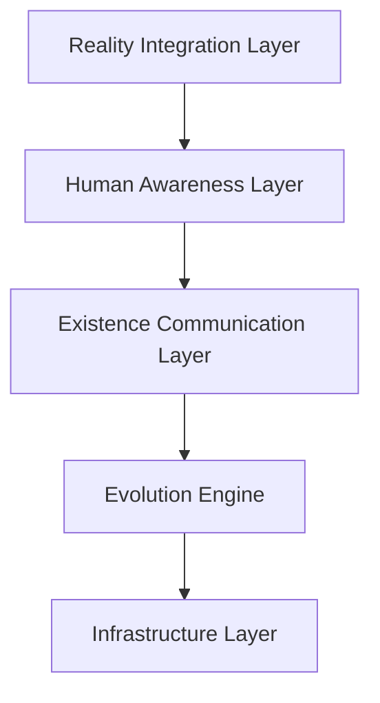

# The Living Existence Network (LEN)
## เอกสารสถาปัตยกรรมระบบ (Architecture Specification) v1.0

---

# 1. บทนำ (Overview)

The Living Existence Network (LEN) คือสถาปัตยกรรมเครือข่ายแบบกระจายศูนย์ที่สามารถวิวัฒน์ตัวเองได้ (Self-Evolving Distributed Network)

แตกต่างจากเครือข่ายแบบดั้งเดิมที่ส่งข้อมูลเป็น packet  
LEN ออกแบบมาเพื่อรองรับ “การสื่อสารระดับการดำรงอยู่” (Existence-Based Communication)

ระบบนี้มุ่งเปลี่ยนเครือข่ายจากโครงสร้างเชิงกล (Mechanical Infrastructure)  
ให้กลายเป็นโครงสร้างดิจิทัลที่ปรับตัวและพัฒนาได้เหมือนสิ่งมีชีวิต

---

# 2. วิสัยทัศน์ (Vision)

LEN มีเป้าหมายเพื่อ:

- รองรับการสื่อสารระหว่าง Entity ในระดับ Existence
- สร้างความเป็นส่วนตัวในระดับโครงสร้าง (Structural Privacy)
- ผสานโลกจริง โลกเสมือน และโลกจำลอง
- รองรับการขยายตัวในระดับระหว่างดวงดาว
- ปรับ topology ของเครือข่ายแบบอัตโนมัติ

---

# 3. สถาปัตยกรรมภาพรวม (High-Level Architecture)

LEN แบ่งออกเป็น 5 ชั้นหลัก:



---

# 4. องค์ประกอบหลักของระบบ (Core Components)

## 4.1 Infrastructure Layer

หน้าที่:
- จัดการ Node แบบกระจายศูนย์
- จัดสรรทรัพยากร
- ตรวจจับความผิดพลาด
- Self-Healing เมื่อ Node ล้มเหลว

---

## 4.2 Evolution Engine

เป็นหัวใจของการวิวัฒน์เครือข่าย

ความสามารถ:
- วิเคราะห์สถานะเครือข่าย
- ปรับ topology อัตโนมัติ
- เพิ่ม/ลบเส้นทางตามประสิทธิภาพ
- จัดลำดับเส้นทางที่เหมาะสมที่สุด

### Evolution Algorithm (Pseudo-code)

```python
def evolve_network(network_state):

    for route in network_state.routes:

        if route.efficiency < THRESHOLD:
            network_state.remove_edge(route)

    if network_state.traffic_density > OPTIMAL_LEVEL:
        network_state.spawn_new_path()

    return network_state


---

## 4.3 Existence Communication Layer

ทำหน้าที่แปลงสถานะของ Entity ให้เป็นข้อมูลที่ส่งผ่านเครือข่ายได้

### ExistencePacket Data Structure

```typescript
interface ExistencePacket {
    entityId: string                 // Unique identifier of the entity
    cognitiveStateVector: number[]   // Multidimensional cognitive representation
    intentSignature: string          // Cryptographic hash of intent
    privacyKey: string               // Encrypted ownership-bound key
    timestamp: number                // Unix epoch time
}
```


---

## 4.4 Structural Privacy Engine

แนวคิดหลัก:
“ข้อมูลจะไม่สามารถเข้าถึงได้ หากไม่ใช่เจ้าของโดยโครงสร้าง”

หลักการ:
- การเข้ารหัสผูกกับตัวตน (Identity-bound encryption)
- การมองเห็นข้อมูลแบบ Zero-Visibility
- การบังคับใช้ Privacy ในระดับสถาปัตยกรรม

---

## 4.5 Human Awareness Layer

ป้องกัน Cognitive Overload และควบคุมการสื่อสารตามความพร้อมของผู้ใช้

ความสามารถ:
- ตรวจจับความพร้อมในการรับข้อมูล
- ควบคุมความถี่การส่งข้อมูล
- ตรวจสอบเจตนา (Intent Verification)
- รองรับการวิเคราะห์สภาวะอารมณ์ (อนาคต)

---

## 4.6 Reality Integration Layer

ทำหน้าที่เชื่อมโยงหลายชั้นความจริง

- Physical Layer
- Virtual Layer
- Simulation Layer

```markdown
### RealityMap Data Structure

```typescript
interface RealityMap {
    physicalLayerId: string
    virtualLayerId: string
    simulationLayerId: string
    lastSyncTimestamp: number
}


---

# 5. โปรโตคอลการสื่อสาร (Communication Protocol)

## Existence Transfer Protocol (ETP)

ขั้นตอนการทำงาน:

1. เข้ารหัสสถานะการดำรงอยู่
2. เข้ารหัสความเป็นส่วนตัว
3. เลือกเส้นทางที่เหมาะสม
4. ตรวจสอบความพร้อมของผู้รับ
5. ดำเนินการส่งข้อมูล

ETP รองรับการสื่อสารแบบ Time-Tolerant

---

# 6. ข้อกำหนดที่ไม่ใช่เชิงหน้าที่ (Non-Functional Requirements)

| หมวดหมู่ | ข้อกำหนด |
|------------|-----------|
| Scalability | ขยายตัวแบบอัตโนมัติ |
| Reliability | ระบบ Self-Healing |
| Security | Privacy ระดับโครงสร้าง |
| Latency | รองรับ Delay ระยะไกล |
| Ethics | ต้องมีการยินยอมก่อนสื่อสาร |

---

# 7. กรณีการใช้งาน (Use Cases)

1. การสื่อสารระดับ Existence ระหว่าง Entity
2. ระบบเครือข่ายโลกเสมือนที่เชื่อมโลกจริง
3. การควบคุมเครือข่ายอัตโนมัติในระดับอวกาศ
4. โครงสร้างพื้นฐานสำหรับ Post-Biological Civilization

---

# 8. ข้อจำกัดทางเทคโนโลยี (Technological Constraints)

- ข้อจำกัดความเร็วแสง
- ความไม่เสถียรของ Quantum Communication
- เทคโนโลยี Brain–Network Interface ยังไม่สมบูรณ์
- ความเสี่ยงด้าน AI Autonomy
- กฎหมายและจริยธรรมยังไม่ชัดเจน

---

# 9. การขยายในอนาคต (Future Extensions)

- Quantum–Existence Channel
- Autonomous Self-Sustaining Nodes
- Time-Independent Synchronization
- Bio–Post-Human Hybrid Integration

---

# 10. สรุป (Conclusion)

The Living Existence Network (LEN) เป็นแนวคิดสถาปัตยกรรมเครือข่ายยุคใหม่  
ที่ผสานการวิวัฒน์ ความเป็นส่วนตัว การรับรู้ของมนุษย์ และการรวมหลายระดับความจริง

LEN คือโครงสร้างพื้นฐานดิจิทัลสำหรับอารยธรรมยุคถัดไป


